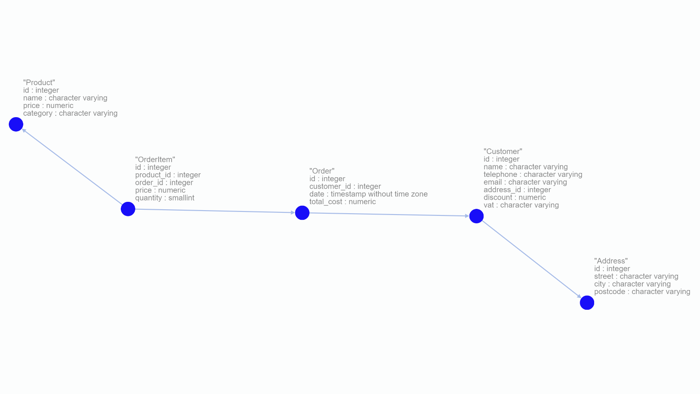

# dash-store-project
web app based on dash framework which manages orders and creates invoices in xlsx format

## Getting started

### Windows

1. clone repo using: **git clone https://github.com/Chris9292/dash-store-project.git** or download zip file
2. download and install Postgres [https://www.postgresql.org/](https://www.postgresql.org/) (set superuser password)
3. open Terminal in project directory
4. connect to psql: **psql -U postgres**
5. create database: **CREATE DATABASE database_name;**
6. exit psql: ctrl+c
7. import sql file: **pg_dump -U postgres -d database_name > db/db.sql**
8. configure database.py: set _username_, _password_, _database_
9. run the app: **venv\scripts\python.exe index.py** in terminal or double click **app.bat**  
10. the app is running on **http://127.0.0.1:8050/** by default

### Linux/Mac

1.
2.
3.
4.
5.
6.
7.
8.

## Documentation

### The structure of the database:

### template used for invoice

