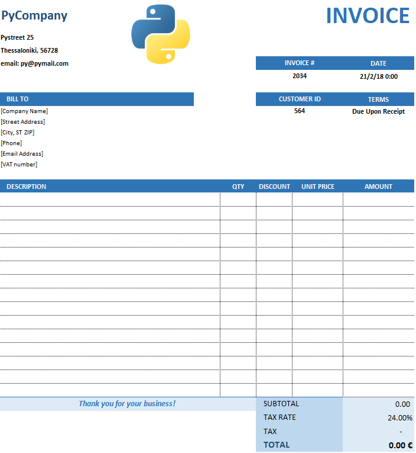

# dash-store-project
web app based on dash framework which manages orders and creates invoices in xlsx format

This program:
- keeps your data organized
- makes the workflow more efficient
- saves time from paperwork
- reduce the risk of human error through automation

Functionalities of this app:
- view tables of database (filtering enabled)
- create orders and prepare ready for print invoice
- add product/customer

## Getting started
1. Install postgres
2. import sql file
3. run app

### Windows

1. clone repo using: **git clone https://github.com/Chris9292/dash-store-project.git** or download zip file
2. download and install Postgres [https://www.postgresql.org/](https://www.postgresql.org/) (set superuser password)
3. add **[path to PostgreSQL]\\[version]\bin** to **path**: 
4. open Terminal in project directory and connect to psql: **psql -U postgres**
5. create database: **CREATE DATABASE database_name;**
6. exit psql: ctrl+c
7. import sql file: **psql -U postgres -d database_name > db/db.sql**
8. configure database.py: set _username_, _password_, _database_, _port_
9. run the app: **venv\scripts\python.exe index.py** in terminal or double click **app.bat**  
10. the app is running on **http://127.0.0.1:8050/** by default

### Linux/Mac

1.
2.
3.
4.
5.
6.
7.
8.

## Documentation

### The structure of the database:

### template used for invoice:

